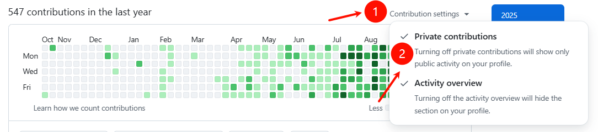
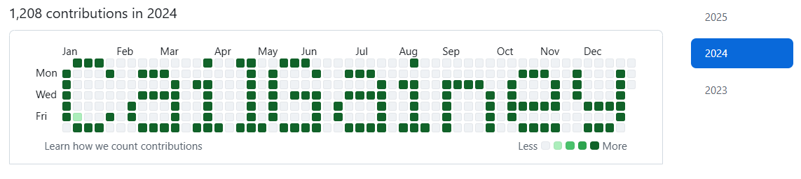
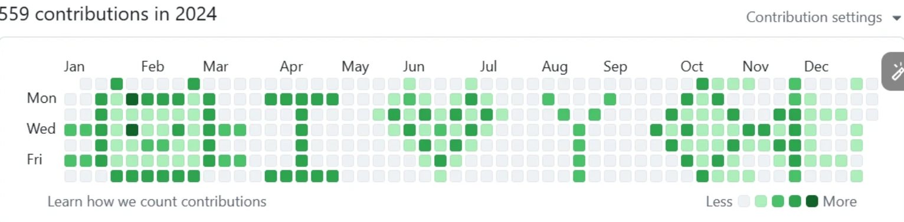
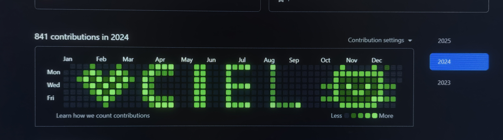
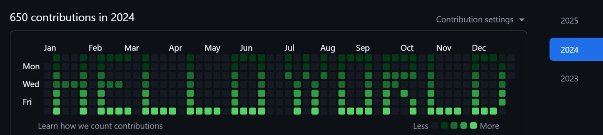
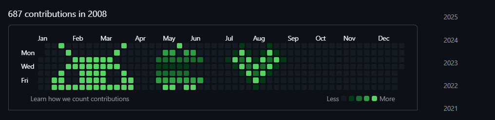

# README (English)

> 中文: [README (中文)](README_zh.md)

## How to use

Make sure git is installed on your computer.


Download the application, open it, and let your creativity flow! Generating a repository may take a while. After generation, copy the repository folder and enter it to continue.

### Windows/Linux

Download and run the application directly.

### macOS

Since this application is not yet signed, you may encounter security restrictions on first launch. Follow these steps to resolve:

```bash
cd the-directory-where-green-wall.app-is-located
sudo xattr -cr ./green-wall.app
sudo spctl --master-disable
sudo xattr -r -d com.apple.quarantine ./green-wall.app
```

**Tip:** You don't need to execute all of these commands. Try them in order from top to bottom, and stop once one resolves the issue.

**Warning:** The commands will not automatically launch the application. You need to manually double-click the app to start it (the commands only modify file attributes).

### Quick Tips

- Right-clicking during the painting process can switch between the brush and the eraser.

## Next steps

1. Log in to your GitHub account and create an empty remote repository (do not select README, .gitignore or License).
2. From the generated repository directory run the following commands to push your local repo to the remote:

```bash
git remote add origin <remote-repo-url>
git branch -M main
git push -u origin main
```

Note: After pushing, GitHub may take anywhere from 5 minutes to two days to show the contribution on your profile. You can make the repository private and enable contributions from private repositories in your GitHub contribution settings so others can't see the repo contents but your contribution activity will still be counted.



## Rendering







## Development Guide

- Environmental Preparation

  Install Go 1.23+

  Install Node.js (v22+)

  Install Git

- Install dependent tools

  ```
  go install github.com/wailsapp/wails/v2/cmd/wails@v2.10.2
  ```

- Project operation

  Clone the repository and enter the directory:

  ```
  git clone https://github.com/zmrlft/GreenWall.git
  cd GreenWall
  ```

  Install front-end dependencies:

  ```
  cd frontend && npm install
  ```

  Start the development environment

  ```
  wails dev
  ```

  Construction

  ```
  wails build
  ```

  Output path: build/bin/

## Future features

We may add support for creating repositories in custom languages. For example, if you want a Java repository, the tool would generate one and it would be reflected in your GitHub language statistics.

## Star History

[](https://www.star-history.com/#zmrlft/GreenWall&type=date&legend=top-left)

## Disclaimer

This project is provided for educational, demonstration, and research purposes related to GitHub contribution mechanics. Misuse (for example to falsify job applications) is the user's responsibility.
