# README (中文)

> English: [README (English)](README.md)

## 目录

- [项目里程碑](#项目里程碑)
- [如何使用](#如何使用)
  - [图片转贡献图](#图片转贡献图)
  - [快速提示](#快速提示)
  - [平台说明](#平台说明)
- [效果图](#效果图)
- [开发指南](#开发指南)
- [Star History](#star-history)
- [免责](#免责)

## 项目里程碑

11月初，本项目获阮一峰大佬的推荐，正式收录于[科技爱好者周刊372期](https://www.ruanyifeng.com/blog/2025/11/weekly-issue-372.html)；11月中旬，获知名大V“it咖啡馆”推荐，正式收录于[Github一周热点93期](https://youtu.be/pjQftatKpjc?si=5pMK1bAyFXfp6oyF)；12月，以“有趣的项目”身份顺利入选知名开源社区“你好Github”<a href="https://hellogithub.com/repository/zmrlft/GreenWall" target="_blank"></a>

## 如何使用

请确保你的电脑已经安装了 Git。


下载软件后，先获取 PAT 来登录 GitHub。可参考：[如何获取你的 GitHub 访问令牌](docs/githubtoken.md)。

### 图片转贡献图

- 上传图片（PNG/JPG/SVG），一键生成贡献热力图。
  - 建议使用线条清晰、对比度适中的图片，细节过多会在压缩后丢失。
- 自由设置行数（1~7）和列数（1~52），匹配图片形状。
- 两种模式：
  - **自动**：会保留色阶变化。
  - **二值化**：仅保留最深色和无色。
- 可调亮度反转、阈值、缩放平滑、笔画补强。
- 在日历上悬停定位，左键应用，右键取消。

**小贴士**
- 二值化结果太稀疏时，加大“二值补笔画强度”。
- 文字清晰优先选“邻近点（保细节）”。
- 如果既想保留色阶又想提高文字清晰度，可适当提高亮度阈值。

**成果示例**
- 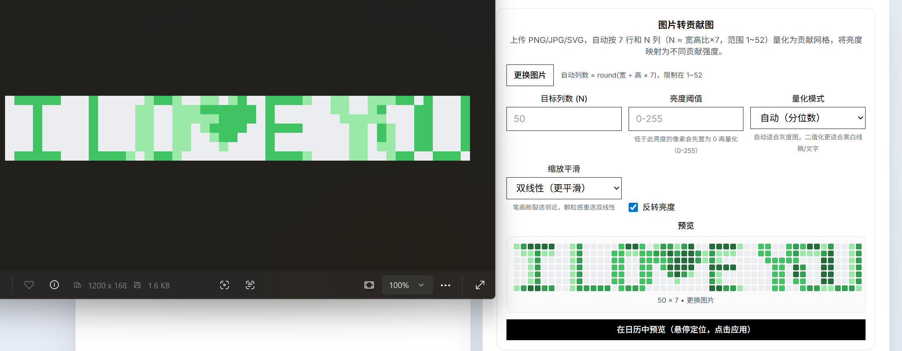
- 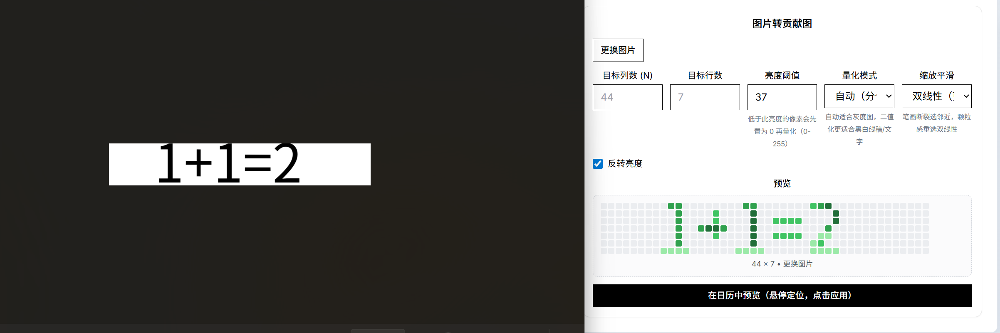
- 
- 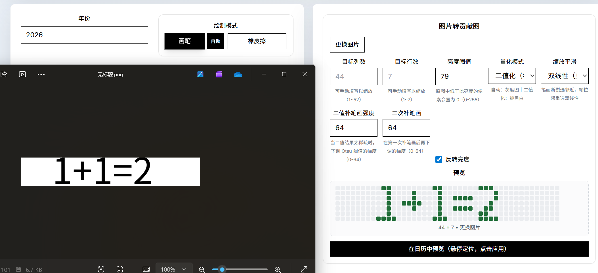

**失败示例**
- 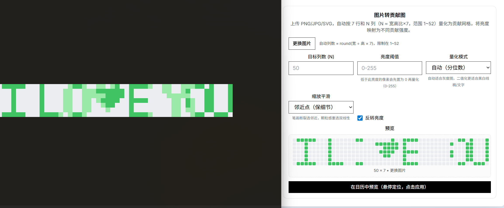
- 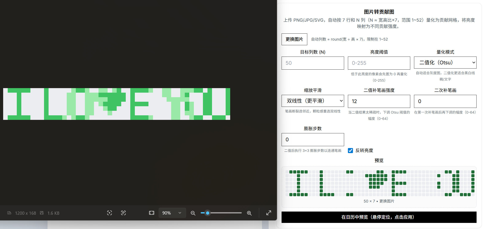
- 

登录成功后，左上角会显示你的头像和名字。拖动鼠标在日历上绘制图案，完成后点击创建远程仓库。你可以自定义仓库名称和描述，选择仓库是否公开，确认后点击生成并推送，软件会自动在你的 GitHub 上创建并推送仓库。

> 注意：GitHub 可能需要 5 分钟到两天才会显示贡献图案。你可以把仓库设为私有，并在贡献统计里开启“显示私有仓库贡献”，这样他人看不到仓库内容但能看到你的贡献记录。

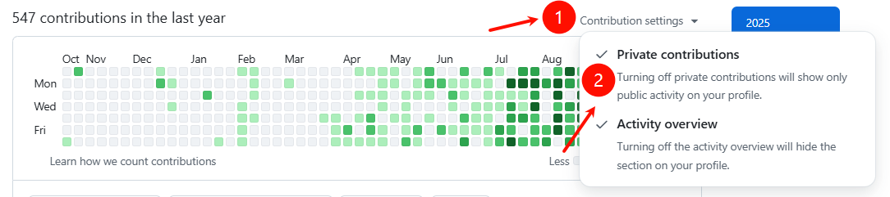

### 快速提示

- 绘画过程中右键可以切换画笔和橡皮擦。
- 可以调节画笔强度。
- **复制粘贴功能**：点击“复制模式”进入复制模式，在日历上拖选区域后按 `Ctrl+C` 复制。复制成功后，被选区域会跟随鼠标作为预览。你可以左键点击或按 `Ctrl+V` 粘贴到目标位置，右键取消粘贴预览。按 `Ctrl+V` 也可以快速恢复上次复制的图案。

### 平台说明

#### Windows/Linux

下载后直接运行即可（开源软件被误报为病毒属于常见现象）。

#### macOS

由于本应用暂未签名，首次运行时可能遇到系统安全限制。可按以下步骤处理：

```bash
cd 你的green-wall.app存在的目录
sudo xattr -cr ./green-wall.app
sudo xattr -r -d com.apple.quarantine ./green-wall.app
```

**提示：** 不需要全部执行，从上到下依次尝试，问题解决后即可停止。

**警告：** 命令执行后不会自动启动应用，需要手动双击打开（命令仅修改文件属性）。

## 效果图

| 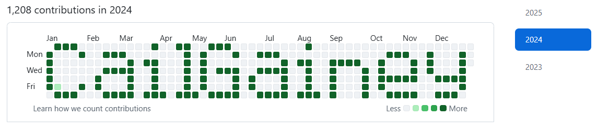 | 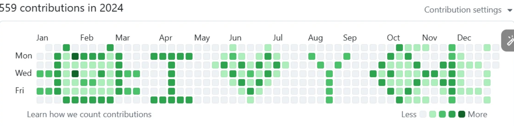 |
| --- | --- |
| 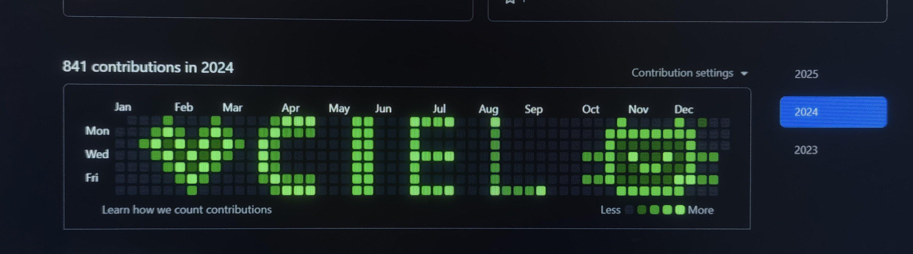 | 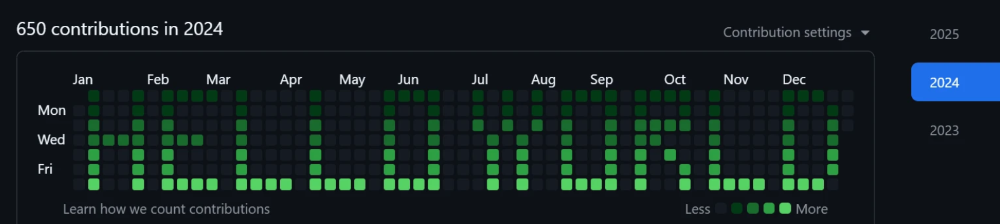 |
| 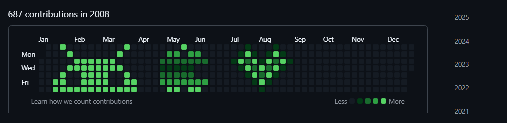 |  |

## 开发指南

### 环境准备

- 安装 Go 1.24+
- 安装 Node.js (v22+)
- 安装 Git

### 安装依赖工具

```bash
go install github.com/wailsapp/wails/v2/cmd/wails@v2.10.2
```

### 项目操作

克隆仓库并进入目录：

```bash
git clone https://github.com/zmrlft/GreenWall.git
cd GreenWall
```

安装前端依赖：

```bash
cd frontend && npm install
```

启动开发环境：

```bash
wails dev
```

构建：

```bash
wails build
```

输出路径：`build/bin/`

## Star History

[](https://www.star-history.com/#zmrlft/GreenWall&type=date&legend=top-left)

## 免责

本项目仅用于教育、演示及研究 GitHub 贡献机制；如用于求职造假等不当用途，后果由使用者自行承担。
