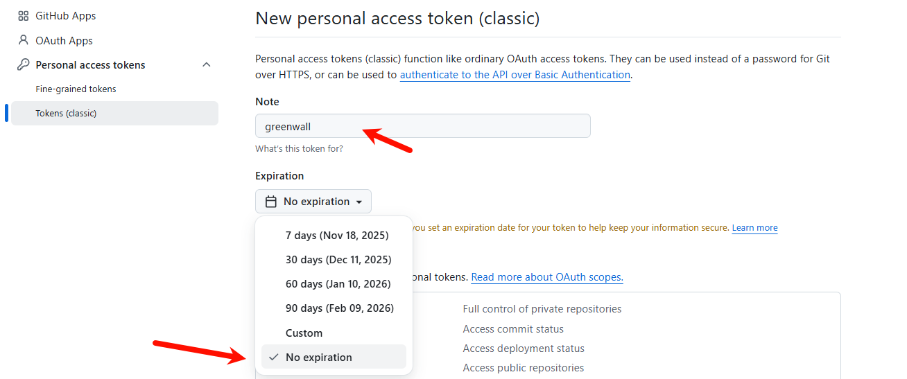
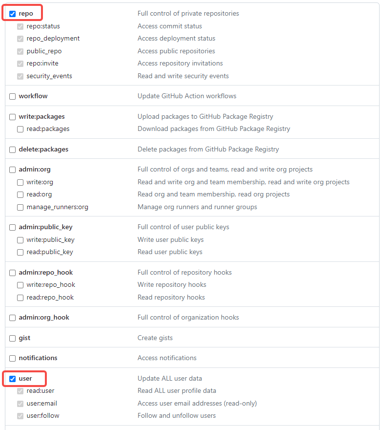
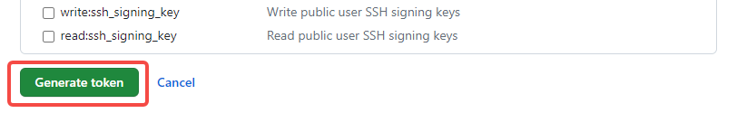
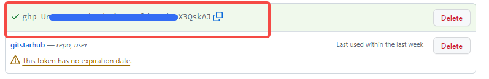

# How to Generate Your GitHub Personal Access Token (classic)

> 中文: [如何获取 PAT](githubtoken.md)

1. Open <https://github.com/settings/tokens/new>.
2. Configure the form as shown below:
   - `Note` can be any name you like.
   - Set `Expiration` to **No expiration** so the token never expires unexpectedly.
   - Select the **repo** and **user** scopes.

3. Click **Generate token**.

4. Copy the generated token into the PAT input field on the login screen and click **Log in**.

> **Note:** PAT stands for *Personal Access Token*. Store it securely and never share it with anyone.
